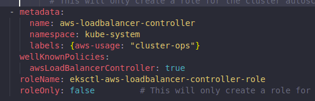

## AWS Load Balancer Controller

### Important Links

[ALB Ingress Annotations](https://kubernetes-sigs.github.io/aws-load-balancer-controller/v2.4/guide/ingress/annotations/)

[Troubleshooting Permission Issues in ALB]([https://](https://aws.amazon.com/premiumsupport/knowledge-center/eks-load-balancer-webidentityerr/))

[TargetPort Missing Issue](https://github.com/kubernetes-sigs/aws-load-balancer-controller/issues/1695)

[Redirect Issues in AWS](https://github.com/kubernetes-sigs/aws-load-balancer-controller/issues/835)

The AWS Load Balancer Controller manages AWS Elastic Load Balancers for a Kubernetes cluster. The controller provisions the following resources:

- An AWS Application Load Balancer (ALB) when you create a Kubernetes `Ingress`.

- An AWS Network Load Balancer (NLB) when you create a Kubernetes service of type `LoadBalancer`. In the past, the Kubernetes network load balancer was used for instance targets, but the AWS Load balancer Controller was used for IP targets. With the AWS Load Balancer Controller version `2.3.0` or later, you can create NLBs using either target type. For more information about NLB target types, see [Target type](https://docs.aws.amazon.com/elasticloadbalancing/latest/network/load-balancer-target-groups.html#target-type) in the User Guide for Network Load Balancers.

- It's an [open-source project](https://github.com/kubernetes-sigs/aws-load-balancer-controller) managed on GitHub. This topic describes how to install the controller using default options. You can view the full [documentation](https://kubernetes-sigs.github.io/aws-load-balancer-controller/latest/) for the controller on GitHub.

- Before deploying the controller, we recommend that you review the prerequisites and considerations in [Application load balancing on Amazon EKS](https://docs.aws.amazon.com/eks/latest/userguide/alb-ingress.html) and [Network load balancing on Amazon EKS](https://docs.aws.amazon.com/eks/latest/userguide/network-load-balancing.html). Those topics also include steps on how to deploy a sample application that require the AWS Load Balancer Controller to provision AWS Application Load Balancers and Network Load Balancers.

### Pre-requisites

- An existing AWS Identity and Access Management (IAM) OpenID Connect (OIDC) provider for your cluster. 
- Make sure that your Amazon VPC CNI plugin for Kubernetes, kube-proxy, and CoreDNS add-ons are at the minimum versions listed in [Service account tokens](https://docs.aws.amazon.com/eks/latest/userguide/service-accounts.html#boundserviceaccounttoken-validated-add-on-versions).
- Your public and private subnets must meet the following requirements. This is unless you explicitly specify subnet IDs as an annotation on a service or ingress object. Assume that you provision load balancers by explicitly specifying subnet IDs as an annotation on a service or ingress object. In this situation, Kubernetes and the AWS load balancer controller use those subnets directly to create the load balancer and the following tags aren't required.
  - Private subnets – Must be tagged in the following format. This is so that Kubernetes and the AWS load balancer controller know that the subnets can be used for internal load balancers. If you use eksctl or an Amazon EKS AWS CloudFormation template to create your VPC after March 26, 2020, the subnets are tagged appropriately when created. For more information about the Amazon EKS AWS CloudFormation VPC templates, see Creating a VPC for your Amazon EKS cluster.
     | Key                             | Value |
     | ------------------------------- | ----- |
     | kubernetes.io/role/internal-elb | 1     |
  - Public subnets – Must be tagged in the following format. This is so that Kubernetes knows to use only the subnets that were specified for external load balancers. This way, Kubernetes doesn't choose a public subnet in each Availability Zone (lexicographically based on their subnet ID). If you use eksctl or an Amazon EKS AWS CloudFormation template to create your VPC after March 26, 2020, the subnets are tagged appropriately when created. For more information about the Amazon EKS AWS CloudFormation VPC templates, see Creating a VPC for your Amazon EKS cluster.  
     | Key                    | Value |
     | ---------------------- | ----- |
     | kubernetes.io/role/elb | 1     |

### Considerations

The AWS Load Balancer Controller creates ALBs and the necessary supporting AWS resources whenever a Kubernetes ingress resource is created on the cluster with the `kubernetes.io/ingress.class: alb` annotation. The ingress resource configures the ALB to route HTTP or HTTPS traffic to different pods within the cluster. To ensure that your ingress objects use the AWS Load Balancer Controller, add the following annotation to your Kubernetes ingress specification. For more information, see Ingress specification on GitHub.

```
annotations:
    kubernetes.io/ingress.class: alb
```

The AWS Load Balancer Controller supports the following traffic modes:
- Instance – Registers nodes within your cluster as targets for the ALB. Traffic reaching the ALB is routed to `NodePort` for your service and then proxied to your pods. This is the default traffic mode. You can also explicitly specify it with the `alb.ingress.kubernetes.io/target-type: instance` annotation.
  
  > Your Kubernetes service must specify the NodePort or "LoadBalancer" type to use this traffic mode.

- IP – Registers pods as targets for the ALB. Traffic reaching the ALB is directly routed to pods for your service. You must specify the `alb.ingress.kubernetes.io/target-type: ip` annotation to use this traffic mode. The IP target type is required when target pods are running on Fargate.   
- To tag ALBs created by the controller, add the following annotation to the controller: alb.ingress.kubernetes.io/tags. For a list of all available annotations supported by the AWS Load Balancer Controller, see Ingress annotations on GitHub.
- Upgrading or downgrading the ALB controller version can introduce breaking changes for features that rely on it. For more information about the breaking changes that are introduced in each release, see the ALB controller release notes on GitHub   

#### To share an application load balancer across multiple service resources using IngressGroups

To join an ingress to a group, add the following annotation to a Kubernetes ingress resource specification.

`alb.ingress.kubernetes.io/group.name: my-group`

The controller automatically merges ingress rules for all ingresses in the same ingress group. It supports them with a single ALB. Most annotations that are defined on an ingress only apply to the paths defined by that ingress. By default, ingress resources don't belong to any ingress group.

> **Potential security risk**: Specify an ingress group for an ingress only when all the Kubernetes users that have RBAC permission to create or modify ingress resources are within the same trust boundary. If you add the annotation with a group name, other Kubernetes users might create or modify their ingresses to belong to the same ingress group. Doing so can cause undesirable behavior, such as overwriting existing rules with higher priority rules. 

You can add an order number of your ingress resource.

`alb.ingress.kubernetes.io/group.order: '10'`

The number can be 1-1000. The lowest number for all ingresses in the same ingress group is evaluated first. All ingresses without this annotation are evaluated with a value of zero. Duplicate rules with a higher number can overwrite rules with a lower number. By default, the rule order between ingresses within the same ingress group is determined lexicographically based namespace and name.

> Ensure that each ingress in the same ingress group has a unique priority number. You can't have duplicate order numbers across ingresses.

### Deploying AWS Load Balancer Controller

1. Create IAM Policy which allows EC2 ASG access with recommended permission.
2. Create a role with above policy attached.
3. In eksctl we can automate this using `serviceAccount` block like this

    

4. Install AWS Load Balancer Controller: 
   1. `curl -Lo cert-manager.yaml https://github.com/jetstack/cert-manager/releases/download/v1.5.4/cert-manager.yaml`   (You need access to quay.io container registry)
   2. `kubectl apply --validate=false -f ./cert-manager.yaml`
   3. `curl -Lo v2_4_4_full.yaml https://github.com/kubernetes-sigs/aws-load-balancer-controller/releases/download/v2.4.4/v2_4_4_full.yaml`
   4. In the above downloaded YAML remove the whole `serviceAccount` section as we have already created a service with attached role with `eksctl`. This can also be done with this command: `sed -i.bak -e '480,488d' ./v2_4_4_full.yaml`
   5. Replace your-cluster-name in the Deployment spec section of the file with the name of your cluster by replacing my-cluster with the name of your cluster. This can also be done with this command: `sed -i.bak -e 's|your-cluster-name|my-cluster|' ./v2_4_4_full.yaml`
   6. `kubectl apply -f v2_4_4_full.yaml`
   7. `curl -Lo v2_4_4_ingclass.yaml https://github.com/kubernetes-sigs/aws-load-balancer-controller/releases/download/v2.4.4/v2_4_4_ingclass.yaml`
   8. `kubectl apply -f v2_4_4_ingclass.yaml`