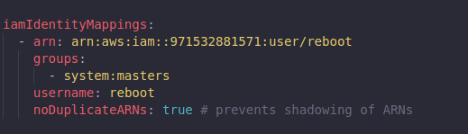
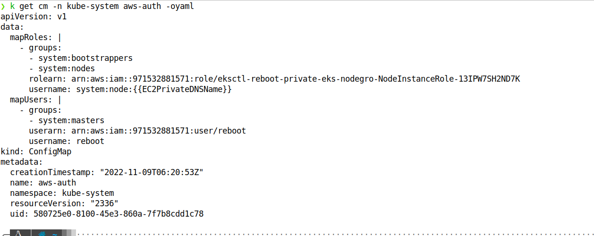
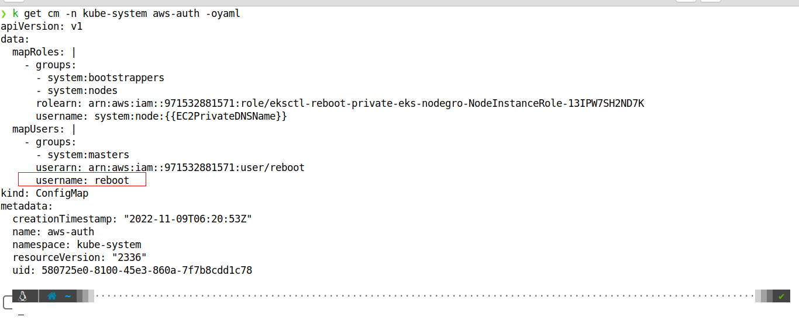
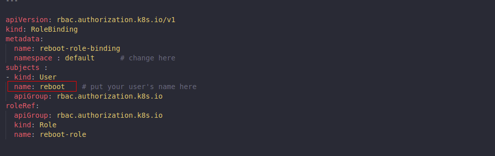

### Access to EKS through IAM Roles and IAM Users

[AWS IAM Autheticator Working](https://blog.lightspin.io/exploiting-eks-authentication-vulnerability-in-aws-iam-authenticator)

Access to your cluster using AWS Identity and Access Management (IAM); entities is enabled by the [AWS IAM Authenticator for Kubernetes](https://github.com/kubernetes-sigs/aws-iam-authenticator#readme), which runs on the Amazon EKS control plane. The authenticator gets its configuration information from the `aws-auth` ConfigMap. For all `aws-auth` ConfigMap settings, see [Full Configuration Format on GitHub](https://github.com/kubernetes-sigs/aws-iam-authenticator#full-configuration-format). 

#### Add IAM users or roles to your Amazon EKS cluster

When you create an Amazon EKS cluster, the AWS Identity and Access Management (IAM) entity user or role, such as a federated user that creates the cluster, is automatically granted system:masters permissions in the cluster's role-based access control (RBAC) configuration in the Amazon EKS control plane. This IAM entity doesn't appear in any visible configuration, so make sure to keep track of which IAM entity originally created the cluster. 

**To grant additional AWS users or roles the ability to interact with your cluster**, you must edit the `aws-auth` ConfigMap within Kubernetes and create a Kubernetes rolebinding or clusterrolebinding with the name of a group that you specify in the `aws-auth` ConfigMap.

#### Configuration Steps

1. Create a role/user with the policy permission to `EKS ReadOnly` or `EKS Describe` permissions so that user/role can use the `aws eks update-kubeconfig` command.
2. Now in the [eksctl-bootstrap.yaml](../eksctl-bootstrap/eksctl-bootstrap-config.yaml) we can add the user/role as shown below. This will automatically add these roles/users in the `aws-auth` configMap automatically.

   
   
3. Now our user/role has been appended and now is autheticated to use EKS but if we run any command we will get `unauthorized` error saying `User <example-user> cannot perform get on <xyz> resource in api group <abc>`
4. Now this is we because our user is only authenticated but not authorized. So for that we need to configure RBAC for the user/role.
5. For RBAC create a role and role binding YAM file with role giving access to all the api groups and verbs that user can access.
6. **And in the rolebinding we have to pass `roleRef` of the role that we create in step 5 and in the `subject` section we have to pass the username of the user to whom this role is attached. Username here we have to pass which we have specified in the `aws-auth` configMap.**
   
   
   